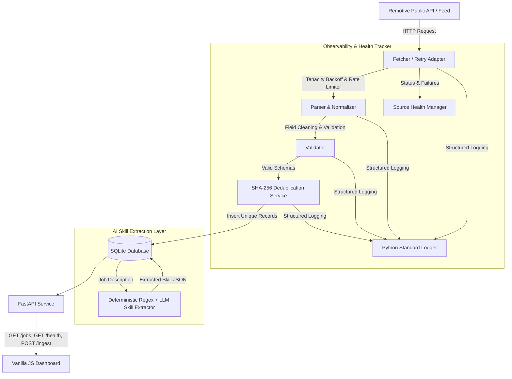

# JobPulse — Resilient Job Ingestion Engine

> Built for the **AcdyOn Technologies AI Engineer Assignment** (Part 1 — Getting Data Out of a Platform That Doesn't Want You To).

JobPulse is a production-style, resilient job ingestion engine designed to ingest public job listings, normalize them into a consistent schema, deduplicate them deterministically, extract technical skills, monitor source health, and expose job intelligence through a clean API and dashboard.

---

## 🏗 Architecture & Pipeline Design



---

## 🛠 Tech Stack

* **Backend Framework**: Python 3.11+, FastAPI, Pydantic v2
* **ORM & Persistence**: SQLAlchemy (SQLite for assignment, clean repository layer for PostgreSQL)
* **HTTP & Resilience**: `httpx` with `tenacity` exponential backoff retries
* **Frontend**: HTML5, CSS3 (Vanilla Dark Mode with Glassmorphism, 390px mobile responsive), Vanilla JavaScript (ES6)
* **Testing**: `pytest`, `httpx.Client` TestClient
* **Deployment**: Render / Railway ready (`render.yaml`)

---

## 🌐 Data Source & Low-Risk Ingestion Strategy

* **Selected Source**: **Remotive Public Remote Jobs API** (`https://remotive.com/api/remote-jobs`)
* **Why this source?**:
  1. **100% Public & Open**: Remotive provides a free, unauthenticated API explicitly intended for job search tools.
  2. **No Bot Evasion / Scraping Required**: Complies 100% with the assignment guardrail ("Run against a low-risk public source; do not scrape LinkedIn").
  3. **Rich Data Fields**: Returns title, company, location, published date, tags, URL, and full job descriptions.

---

## 🛡 Resilience & Failure Handling Strategy

The ingestion engine explicitly handles real-world failure modes:

| Scenario | System Behavior & Protection |
| :--- | :--- |
| **1. Temporary Outage** | `DataFetcher` executes up to 3 retries with exponential backoff (1s → 2s → 4s). If all retries fail, logs a structured error and marks `SourceHealth` as `DEGRADED`/`FAILED` without crashing the application. |
| **2. Empty Payload** | `JobParser` detects zero items, logs a warning, and prevents over-writing or corrupting stored database records. |
| **3. Schema / Markup Changes** | Strict Pydantic and `JobParser` validation checks reject malformed items missing titles or URLs, keeping stored data clean. |
| **4. Duplicate Listings** | `SHA-256` deterministic hashing (`source:company:title:url`) identifies existing jobs and skips duplicates before DB insertion. |
| **5. API Exceptions** | FastAPI handles internal errors cleanly, returning structured JSON error payloads instead of exposing raw stack traces. |

---

## 📊 API Endpoints

| Method | Endpoint | Description |
| :--- | :--- | :--- |
| `GET` | `/` | Serves the JobPulse frontend dashboard |
| `GET` | `/api/health` | Returns overall system health, database status, and real source health metrics |
| `GET` | `/api/jobs` | Returns paginated listings with keyword, location, company, and source filters |
| `GET` | `/api/jobs/{id}` | Returns detailed job view by primary ID |
| `POST`| `/api/ingest` | Manual trigger endpoint to initiate an on-demand ingestion run |

---

## ⚡ AI Skill Extraction Feature

* **Implementation**: Deterministic regex boundary pattern matcher combined with an optional LLM fallback hook (`GEMINI_API_KEY`).
* **Fail-Safe**: If no LLM key is provided, the core ingestion engine runs with 100% deterministic reliability, parsing technical skills (e.g. Python, SQL, FastAPI, React, Docker, PyTorch) from job descriptions.

---

## 🚀 Local Setup & Running Instructions

### 1. Clone & Set Up Environment
```bash
git clone https://github.com/your-username/jobpulse.git
cd jobpulse/backend
python -m venv .venv
# Windows:
.venv\Scripts\activate
# Linux/macOS:
source .venv/bin/activate
pip install -r requirements.txt
```

### 2. Run Application Server
```bash
py -3 -m uvicorn app.main:app --app-dir backend --reload --port 8000
```
*(Or `cd backend` and run `py -3 -m uvicorn app.main:app --reload --port 8000`)*
Open your browser at: `http://localhost:8000`

---

## 🧪 Running Automated Tests

```bash
pytest backend/tests -v
```

All 8 core test suites mock external HTTP requests to guarantee fast, offline execution.

---

## ⚖️ Ethical & Technical Boundary

> **Explicit Declaration**:
> I intentionally did not attempt to bypass CAPTCHA, authentication, anti-bot controls, access restrictions, or platform protections. The live application ingests data exclusively from low-risk, public API/RSS endpoints suitable for automated access.

---

## 🎯 Follow-Up Interview Preparation Guide

### 1. Why FastAPI?
FastAPI provides high-performance asynchronous execution, automatic Pydantic data validation, and OpenAPI documentation out of the box with minimal boilerplate.

### 2. Why SQLite?
SQLite is zero-config, single-file serverless storage perfect for assignments and demos. SQLAlchemy ORM is used so we can switch to PostgreSQL by changing `DATABASE_URL` in production.

### 3. How does deduplication work?
We compute a deterministic SHA-256 fingerprint from `f"{source}:{company}:{title}:{url}"`. If a record with that hash already exists in the database, re-ingestion skips inserting it.

### 4. How does exponential backoff work?
`tenacity` catches transient HTTP or network timeouts and waits 1s after attempt 1, 2s after attempt 2, and 4s after attempt 3 before failing gracefully and logging the status.

### 5. What happens if the source changes its payload format?
Our `JobParser` validates that essential fields (`title`, `company`, `url`) exist. Invalid items are rejected and logged; valid items are stored. The web app remains online.
